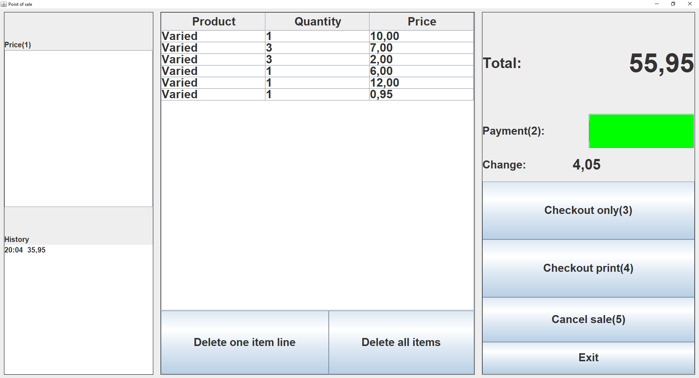

# Simple Point Of Sale With Ticket Printing Java Linux

This is a simple point of sale (POS) system with printing (ESC/POS) feature in Java for Linux.

I made this long time ago for a friend to be used in a small shop, installed in a laptop with Ubuntu OS, and a ESC/POS type ticket printer. The printer looks like Epson TM-U220D model, with Epson logo, but I think it's a knockoff because official Epson drivers doesn't work.

Right now all texts are hardcoded. Like ticket format, shop datas, language. Modify them to fit your needs.

# Features

- Create a sale with or without printing ticket after checkout
- For a sale, the user can add as much items as it wants, and the program keeps track and displays the list of items, the quantity of items per type of price, and the total price
- Delete one selected item or all items from list
- Checkout only, without printing ticket
- Checkout with printing ticket
- Cancel sale
- Prints a formatted ticket via a ESC/POS type ticket printer
- Keeps a small list of history of sales
- Saves the sales in a path in ticket format in text file

# How to run the program

Use the command line:

´´´bash
java -jar simple-point-of-sale.jar "printer's path" "sale save path"
´´´

"printer's path" is the path of the printer device in Linux. It should be something like "/dev/usb/lp0".
"sale save path" is the path where sales are saved.

In this repository includes the simple-point-of-sale.jar file to test.

Also, in this repository inclues the Run.sh file that runs the .jar file by double click on it.

# How to get the program

Download the source, modify to fit your needs, and compile with Java or any Java IDE. I used Eclipse.

# How to use it

## To create a sale:
1. A sale is automatically created, user just has to add items
2. Select the "Price" text box, it will turn green. Type the price of the item or units*price for multiple items of same price, and press ENTER. The program adds one item or multiple items to the table in the center, and displays the total price
3. Once the user is done adding items, it can proceed to checkout
4. Optionally, user can type the clients payment to calculate the change by selecting the payment checkbox (it will turn green) and type in the amount
5. If the user doesn't want to checkout without printing the ticket, press "Checkout only" button. The sale is done, saved and can proceed to a new sale with empty list of items
6. If the user wants to checkout and print the ticket, press "Checkout print" button. The sale is done, saved and can proceed to a new sale with empty list of items
7. If the user wants to cancel the sale, press the "Cancel sale" button. The sale is cancelled, not saved and can proceed to a new sale with empty list of items

## To delete an item
With mouse, select the item on the table and press the button "Delete one item line". One item of that line will be deleted, and the total price is adjusted.
Right now doesn't seems to work...

## To delete all items
1. Press the button "Delete all items" and all items will be deleted (similar to cancel sale)
Right now doesn't seems to work...

## Hotkeys
There are hotkeys to focus text boxes and press buttons, so most sales can be done with only keyboard, which is faster and easier. And that's why there are numbers (#)
- HOME: focus on "Price(1)" text box
- END: focus on "Payment(2)" text box
- PAGE UP: press "Checkout only(3)" button
- PAGE DOWN: press "Checkout print(4)" button
- RIGHT: press "Cancel sale(5)" button
